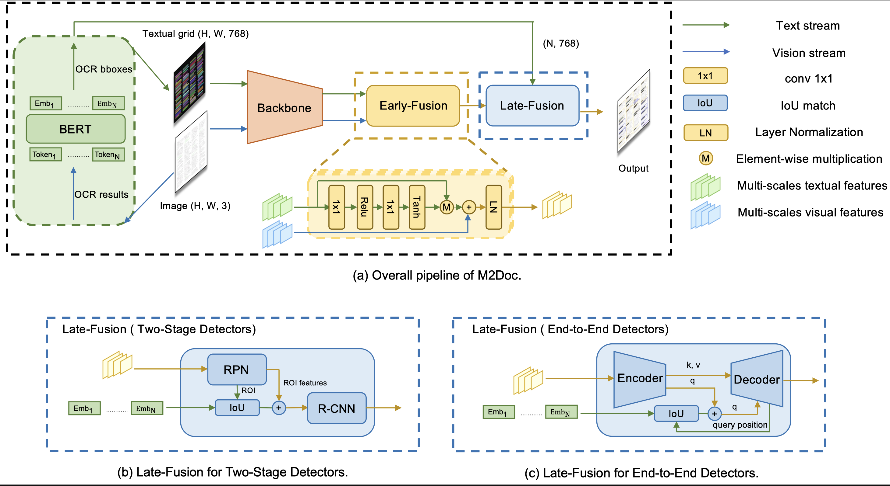

# [AAAI2024] M2Doc: A Multi-Modal Fusion Approach for Document Layout Analysis

The paper is available at [this link](https://ojs.aaai.org/index.php/AAAI/article/view/28552/29073).




## 🚧 TODO List
- [x] Add training script and inference script for DINO_M2Doc.
- [ ] Add training script and inference script for other detectors.
- [ ] Add the data format samples for M2Doc.
- [ ] Add the dataset converting scripts.
- [ ] Release the Model-Zoo of M2Doc on DocLayNet.

## Installation
- Python=3.8.0
- CUDA 10.2
- transformers
- MMDetection
<!-- - OpenCV for visualization -->

## Dataset Prepare
Dataset downloading links: 

- [DocLayNet](https://github.com/DS4SD/DocLayNet)

- [M6Doc](https://github.com/HCIILAB/M6Doc)

- [PubLayNet](https://github.com/ibm-aur-nlp/PubLayNet)

Dataset converting code and dataset samples will be released soon.

## Train and Inference Steps
1. Install the repository (we recommend to use [Anaconda](https://www.anaconda.com/) for installation.)
```
conda create -n m2doc python=3.8 -y
conda activate m2doc
conda install pytorch==1.8.1 torchvision==0.9.1 torchaudio==0.8.1 cudatoolkit=10.2 -c pytorch
pip install transformers
git clone https://github.com/johnning2333/M2Doc.git
cd M2Doc/mmdetection
pip install -v -e .
```

<!-- ```
datasets
|_ totaltext
|  |_ train_images
|  |_ test_images
|  |_ totaltext_train.json
|  |_ weak_voc_new.txt
|  |_ weak_voc_pair_list.txt
|_ mlt2017
|  |_ train_images
|  |_ annotations/icdar_2017_mlt.json
.......
``` -->

2. Train
```
# for multi-gpu training
bash tools/dist_train.sh mmdetection/m2doc_config/dino-4scale_w_m2doc_doclaynet.py 8
```

3. Inference
```
# for multi-gpu inference
bash tools/dist_test.sh mmdetection/m2doc_config/dino-4scale_w_m2doc_doclaynet.py work_dirs/dino-4scale_w_m2doc_r50_8xb2-12e_doclaynet/epoch_12.pth 8
```
<!-- ## Example results:

 -->

## Acknowlegement
[MMDetection](https://github.com/aim-uofa/AdelaiDet)
[DINO](https://github.com/IDEA-Research/DINO)
[VSR](https://github.com/hikopensource/DAVAR-Lab-OCR)

## Citation

If our paper helps your research, please cite it in your publications:

```BibText
@inproceedings{zhang2024m2doc,
  title={M2Doc: A Multi-Modal Fusion Approach for Document Layout Analysis},
  author={Zhang, Ning and Cheng, Hiuyi and Chen, Jiayu and Jiang, Zongyuan and Huang, Jun and Xue, Yang and Jin, Lianwen},
  booktitle={Proceedings of the AAAI Conference on Artificial Intelligence},
  volume={38},
  number={7},
  pages={7233--7241},
  year={2024}
}
```

# Copyright

For commercial purpose usage, please contact Dr. Lianwen Jin: eelwjin@scut.edu.cn

Copyright 2019, Deep Learning and Vision Computing Lab, South China China University of Technology. http://www.dlvc-lab.net